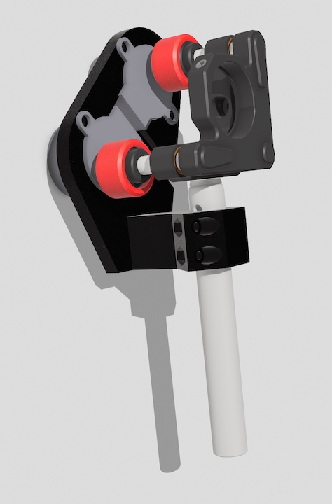

# Description
This repository contains all files to convert a KM100 kinematic mirror mount from thorlabs (https://www.thorlabs.com/thorproduct.cfm?partnumber=KM100#ad-image-0) into a motorized mount, with computer controller tip/tilt. This implementation is a further development of the previous work by Luis José Salazar-Serrano and sources cited therein -  https://github.com/totesalaz/MKM

Here we provide both the 3D model, as well as .stl files of the individual parts that need to be printed.

Parts needed are:
- 1x Motor mount
- 1x Bracket
- 2x Knob adapter
-  2x 28BYJ-48 stepper motor.

To computer control the motors we use an Arduino MEGA with sensor shield, as described here - https://github.com/HorkeLab/arduino_28BYJ-48

# Printing and assembly instructions Instructions

We have printed these in both PLA and PETG without problems. A well-calibrated printer is necessary to avoid excessive friction/stalling of the motors. Typically printed on 0.4mm nozzle, 0.2mm layer height, 15\% infill.

The motor mount fixes the distance between the kinematic mount and the motors, however it does not fix the rotational alignment between them. During assembly care needs to be taken that they are properly oriented parallel to each other.

Since the adjustment (tip/tilt) screws move horizontally as the mirror is moved, the idea is that the printed knob adapters can slide along the motor shaft (while the motor itself is firmly fixed). The knob adapters should therefore not be fixed to the motor shaft.